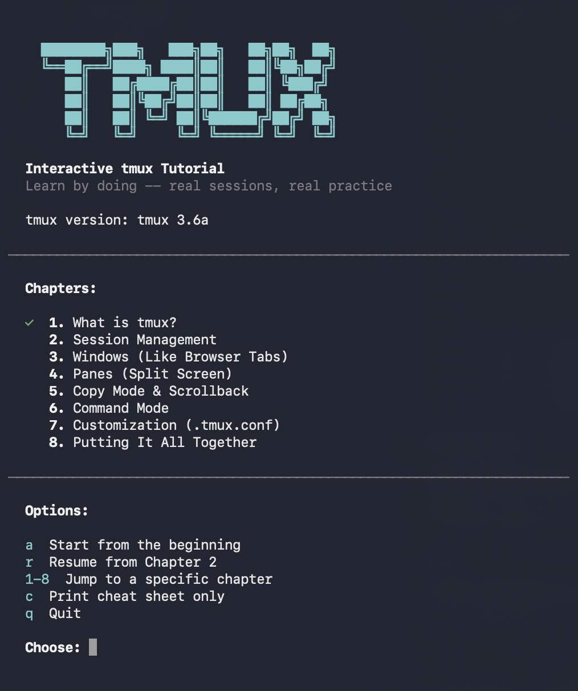

# tmux Tutorial

An interactive tutorial that teaches tmux by doing. Instead of just reading docs, you practice in **real tmux sessions** created by the script — then it verifies what you did.

<p align="center">
  
</p>

## Quick Start

```bash
# Make sure tmux is installed
tmux -V

# Run the tutorial
bash tmux-tutorial.sh
```

> **Note:** Must be run outside of tmux (not inside an existing session).

## Usage

```bash
bash tmux-tutorial.sh          # Interactive menu
bash tmux-tutorial.sh 4        # Jump to chapter 4
bash tmux-tutorial.sh cheat    # Print cheat sheet
```

## Chapters

1. **What is tmux?** — Core concepts and your first session
2. **Session Management** — Create, list, attach, detach, and kill sessions
3. **Windows** — Tabs within a session: create, rename, navigate
4. **Panes** — Split screen: horizontal/vertical splits, resizing, navigation
5. **Copy Mode & Scrollback** — Scroll, search, and copy text
6. **Command Mode** — The tmux `:` command prompt
7. **Customization** — Writing a `.tmux.conf`
8. **Putting It All Together** — Capstone exercise combining everything

Progress is saved automatically between runs.

## Requirements

- tmux
- Bash
